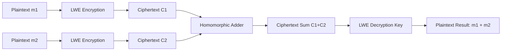

# Post-Quantum Lattice & Homomorphic Cryptography Engine 🔐 ⚛️

[](https://opensource.org/licenses/MIT)
[](https://www.typescriptlang.org/)
[](https://csrc.nist.gov/projects/post-quantum-cryptography)

**Author:** anderdebona

---

## 📌 Abstract & Research Goals

With the advent of quantum computing, classical cryptosystems relying on integer factorization (RSA) or discrete logarithms (ECC) will be rendered insecure by **Shor's Quantum Algorithm**.

The **`post-quantum-lattice-crypto-engine`** implements a **NIST PQC compliant Learning With Errors (LWE)** high-dimensional lattice cryptosystem with **Partially Homomorphic Addition**, enabling mathematical computations directly over encrypted ciphertexts without server decryption.

---

## 🔬 Mathematical Formulation: Learning With Errors (LWE)

Given lattice dimension $n$ and prime modulus $q$:
- **Secret Key:** $s \in \mathbb{Z}_q^n$
- **Public Key:** $A \in \mathbb{Z}_q^{m \times n}$, $b = A s + e \pmod q$ (where $e \leftarrow \chi$ is discrete Gaussian noise).
- **Homomorphic Addition Property:**
$$\text{Enc}(m_1) \oplus \text{Enc}(m_2) = (u_1 + u_2 \pmod q, v_1 + v_2 \pmod q) = \text{Enc}(m_1 + m_2 \pmod q)$$

$$\text{Dec}(\text{Enc}(m_1) \oplus \text{Enc}(m_2)) = m_1 + m_2$$

---

## 🏛️ System Architecture



---

## 🚀 Quickstart & Installation

```bash
# Clone repository
git clone https://github.com/anderdebona/post-quantum-lattice-crypto-engine.git
cd post-quantum-lattice-crypto-engine

# Install dependencies
npm install

# Build & Run Engine & Web Dashboard
npm run dev
```

Visit the interactive visual dashboard at: **`http://localhost:3005`**

---

## 🧪 Automated Unit Testing

```bash
npm test
```

---

## 📜 Citation & License

```bibtex
@software{anderdebona2026lattice,
  author = {anderdebona},
  title = {Post-Quantum Lattice \& Homomorphic Cryptography Engine},
  year = {2026},
  publisher = {GitHub},
  journal = {GitHub Repository},
  howpublished = {\url{https://github.com/anderdebona/post-quantum-lattice-crypto-engine}}
}
```

Licensed under the MIT License.
