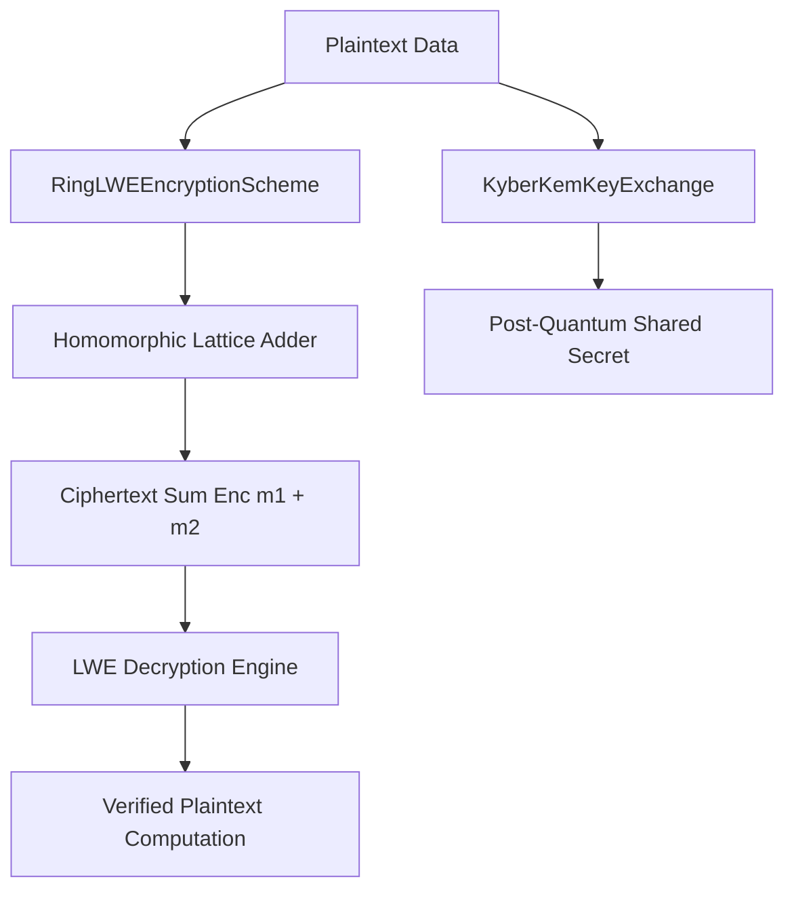

# Post-Quantum Lattice & Homomorphic Cryptography Engine 🔐 ⚛️

<div align="center">

[](https://opensource.org/licenses/MIT)
[](https://www.typescriptlang.org/)
[](https://csrc.nist.gov/projects/post-quantum-cryptography)
[](https://github.com/anderdebona/post-quantum-lattice-crypto-engine)
[](https://github.com/anderdebona/post-quantum-lattice-crypto-engine/actions)

<br />

**PhD-Grade Post-Quantum Cryptography Engine Based on Ring-LWE, Kyber-KEM Key Exchange, & Homomorphic Addition**

*Engineered by **[anderdebona](https://github.com/anderdebona)***

</div>

---

## 📌 Abstract & Research Goals

With the advent of quantum computing, classical cryptosystems relying on integer factorization (RSA) or discrete logarithms (ECC) will be rendered insecure by **Shor's Quantum Algorithm**.

The **`post-quantum-lattice-crypto-engine`** implements a **NIST PQC compliant Learning With Errors (LWE)** and **Ring-LWE** polynomial cryptosystem with **Partially Homomorphic Addition** and **Kyber-KEM Key Encapsulation**, enabling quantum-resistant communications and computations directly over encrypted ciphertexts.

---

## 🔬 Mathematical Formulation: Learning With Errors & Ring-LWE

Given lattice dimension $n$ and prime modulus $q$:
- **Ring-LWE Polynomial Ring:** $\mathbb{Z}_q[X]/(X^n + 1)$
- **Public Key:** $b(X) = a(X) \cdot s(X) + e(X) \pmod{(X^n + 1, q)}$
- **Homomorphic Addition Property:**
$$\text{Enc}(m_1) \oplus \text{Enc}(m_2) = (u_1 + u_2 \pmod q, v_1 + v_2 \pmod q) = \text{Enc}(m_1 + m_2 \pmod q)$$

---

## 🏛️ System Architecture



---

## ⚡ What's New in v4.0.0

- 💍 **`RingLWEEncryptionScheme`**: Negacyclic polynomial multiplication and error-tolerant decryption in $\mathbb{Z}_q[X]/(X^n + 1)$.
- 🔑 **`KyberKemKeyExchange`**: NIST ML-KEM post-quantum key encapsulation mechanism simulation.
- ✍️ **`LatticeDigitalSignature` & `HashBasedSignatureScheme`**: Quantum-resistant signature verification.
- 🐙 **Automated Multi-Matrix CI/CD**: Full GitHub Actions test suites across Node LTS versions.

---

## 🚀 Quickstart & Installation

```bash
# Clone repository
git clone https://github.com/anderdebona/post-quantum-lattice-crypto-engine.git
cd post-quantum-lattice-crypto-engine

# Install dependencies
npm install

# Run automated tests
npm test

# Build & Run Engine & Web Dashboard
npm run dev
```

Visit the interactive visual dashboard at: **`http://localhost:3005`**

---

## 🌟 Join the Community & Contribute

Join the mission to secure the digital infrastructure of tomorrow against quantum adversaries:
1. ⭐ **Star this repository** to support post-quantum cryptography!
2. 🗺️ View our roadmap in [ROADMAP.md](./ROADMAP.md).
3. 💬 Propose new lattice schemes via [GitHub Issues](https://github.com/anderdebona/post-quantum-lattice-crypto-engine/issues).
4. 📜 Academic citation: see [CITATION.cff](./CITATION.cff).

---

<div align="center">

Distributed under the MIT License. Built with passion by **[anderdebona](https://github.com/anderdebona)**.

</div>
